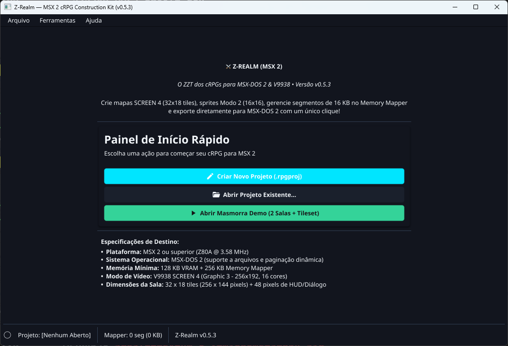
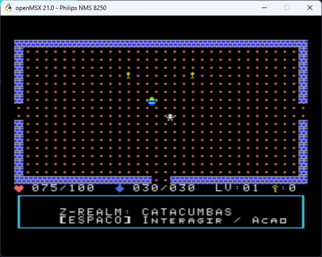
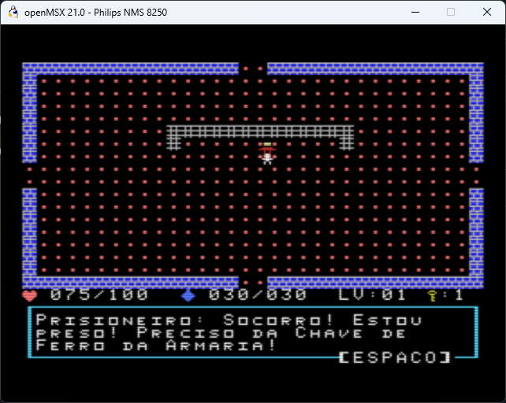
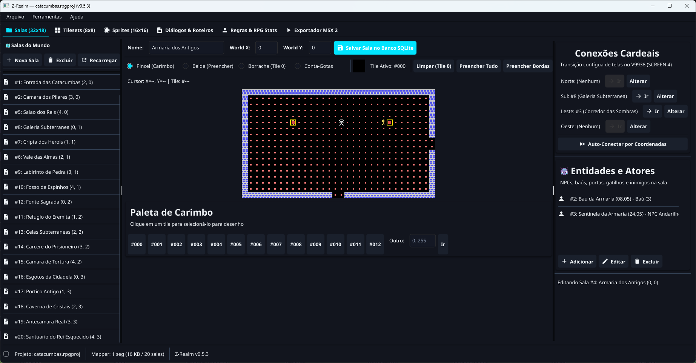
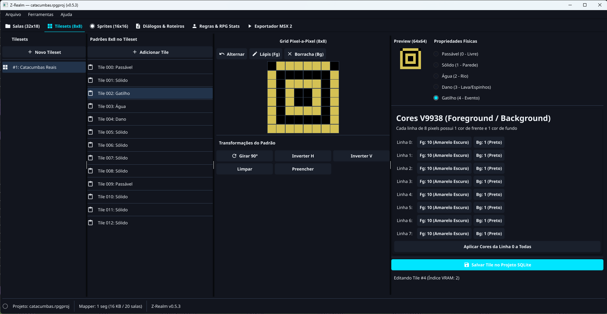
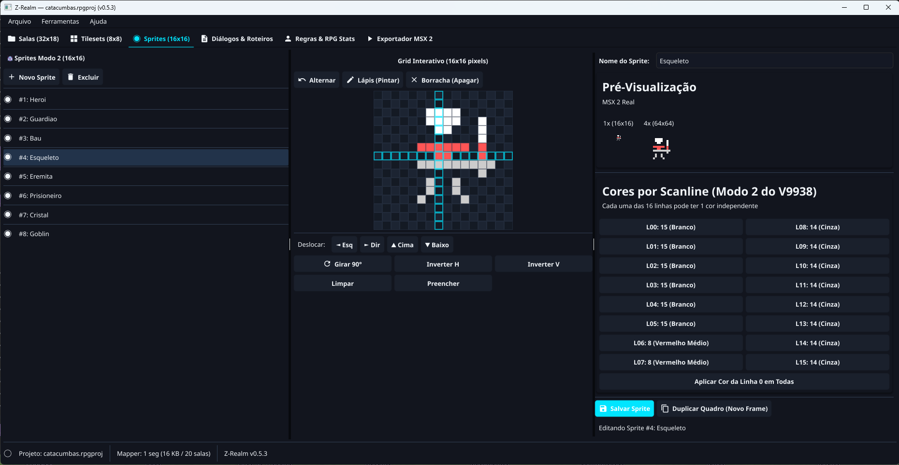
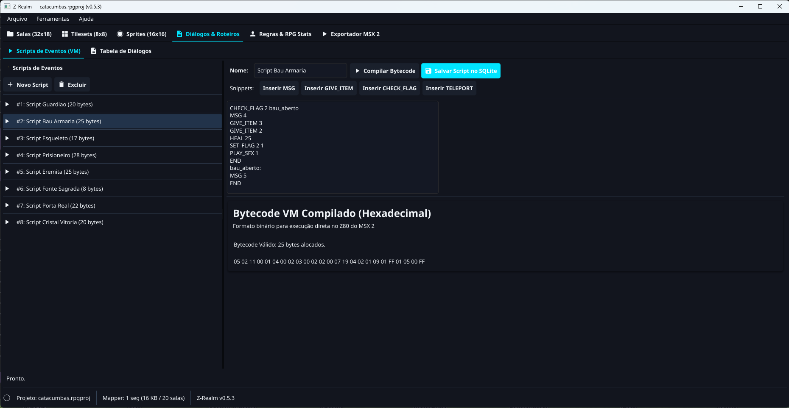
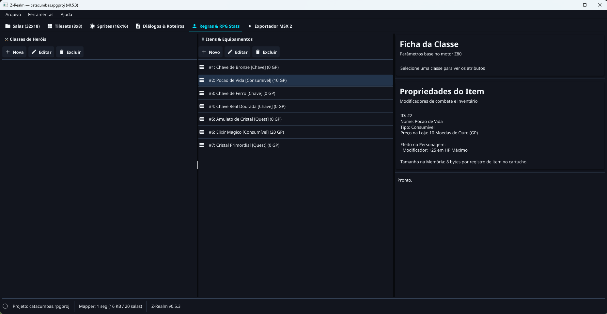
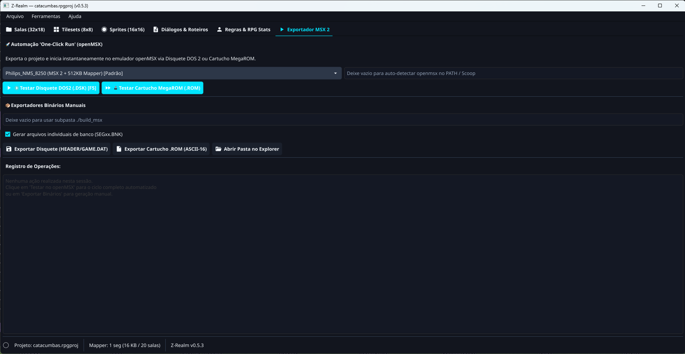

# Z-Realm (`zrealm-msx`)
### *O ZZT dos cRPGs para MSX*

[](LICENSE)
[](SPEC.md)
[](pkg/)
[](MSXgl/)



---

## 1. Visão Geral e Conceito

O **Z-Realm** (`zrealm-msx`) é um ecossistema completo de desenvolvimento e execução de jogos de interpretação (cRPGs) e aventuras interativas para computadores da linha **MSX 2** e **MSX 2+** sob o sistema operacional **MSX-DOS 2** e em cartuchos **MegaROM ASCII-16**.

### Inspirações
* **ZZT (Tim Sweeney, 1991):** Facilidade de criação visual, exploração orientada a salas contínuas, gatilhos e eventos interativos.
* **Os Clássicos dos cRPGs de 8 bits:** A profundidade tática e a atmosfera envolvente de *Ultima*, *Dragon Quest*, *Rogue* e *The Magic Candle*.

### O Jogo de Referência em Execução no MSX 2 (openMSX)
O projeto inclui o cRPG completo **"As Catacumbas de Cristal: O Desafio do Rei Esquecido"**, com 20 salas interligadas em grid 4x5, combate em tempo real, IAs com perseguição, puzzles com chaves hierárquicas e áudio PSG nativo:

| Masmorra SCREEN 4 e HUD em Tempo Real | Diálogos com Paginador e Moldura V9938 |
|:------------------------------------:|:-------------------------------------:|
|  |  |

> 📖 **Quer criar este jogo do zero?** Confira o tutorial passo a passo completo em [catacumbas.md](catacumbas.md)!

---

## 2. A Filosofia de Design: Compilação Estática vs. Interpretação Lenta

Diferente de engines concebidas para PCs velozes que tentam interpretar scripts pesados e matrizes gigantescas no modesto Z80 a 3.58 MHz, o Z-Realm adota uma abordagem de **compilação e empacotamento estático**:

1. **O Editor Visual Desktop (PC):** Desenvolvido em **Go + Fyne + SQLite**, permite modelar o mundo, desenhar tiles e sprites, traçar roteiros de eventos e definir regras de RPG. O editor valida, otimiza e serializa o banco relacional diretamente para **estruturas binárias compactas alinhadas a blocos de 16 KB**.
2. **A Engine MSX (Target Runtime):** Desenvolvida em **C puro (SDCC + MSXgl)**, opera um loop determinístico orientado a eventos discretos no grid (32x18 tiles), com chaveamento instantâneo de segmentos de memória e sem latência mecânica de disco.

---

## 3. Conhecendo as Ferramentas do Editor Visual Desktop

O Editor Visual reúne um conjunto integrado de ferramentas profissionais voltadas para o hardware gráfico e sonoro do MSX 2:

### 3.1 Editor de Salas & Topologia de Conexões Cardeais (32x18 Tiles)
Crie o layout de cada sala com carimbo de tiles, balde de preenchimento, borracha e conta-gotas. Configure conexões cardeais (Norte, Sul, Leste e Oeste) e adicione NPCs, baús e inimigos com pré-visualização em tempo real:



### 3.2 Editor de Tilesets (8x8) com Cores V9938 e Propriedades Físicas
Desenhe padrões de 8x8 pixels com definição de cores de primeiro e segundo plano por linha de varredura (paleta V9938 de 16 cores) e atribua propriedades físicas (`Passável`, `Sólido`, `Água`, `Dano` ou `Gatilho`):



### 3.3 Editor de Sprites (16x16 Modo 2) com Cores por Scanline
Dê vida a heróis, monstros e itens utilizando as capacidades avançadas do Sprite Modo 2 do VDP V9938, permitindo cores individuais para cada uma das 16 linhas horizontais e pré-visualização em 1x e 4x:



### 3.4 Editor de Diálogos & Roteiros com Compilador de Bytecode VM
Escreva histórias e enigmas com linguagem mnemônica simplificada (`MSG`, `GIVE_ITEM`, `CHECK_FLAG`, `SET_FLAG`, `HEAL`, `PLAY_SFX`, `END`). O compilador embutido valida a sintaxe e gera bytecode otimizado para a Máquina Virtual Z80 da engine:



### 3.5 Editor de Regras, Classes e Catálogo de Itens
Defina classes de personagens com atributos base (HP, MP, Ataque, Defesa) e cadastre armas, chaves, consumíveis e itens de missão com seus preços e efeitos no inventário:



### 3.6 Exportador MSX 2 & Automação "One-Click Run" no openMSX
Exporte os dados para imagens de disquete MSX-DOS 2 (`.dsk`), binários avulsos (`HEADER.BIN`, `GAME.DAT`) ou cartuchos MegaROM ASCII-16 (`.ROM`). Pressione **`[F5]`** para compilar, montar e iniciar o jogo automaticamente no emulador **openMSX** com um único clique:



---

## 4. Pilha Tecnológica & Ferramentas

```
+-----------------------------------------------------------------------+
|                         PC / DESKTOP (Editor)                         |
|                                                                       |
|  [ Fyne GUI (Go) ]  <--->  [ Project Repository (Go) ]                |
|         |                            |                                |
|         v                            v                                |
|  [ Visual Editors ]          [ SQLite Database ]                      |
|  (Tiles, Maps, Scripts)      (Entities, Dialogues, Flags, Maps)       |
|                                      |                                |
|                                      v                                |
|                           [ Asset Packer / Exporter ]                 |
+--------------------------------------|--------------------------------+
                                       | Chunks binários / .BNK
                                       v
+-----------------------------------------------------------------------+
|                    MSX TOOLCHAIN (SDCC + MSXgl)                       |
|                                                                       |
|  [ Engine Core (C) ] + [ Generated Assets ] ---> [ SDCC Linker ]      |
+--------------------------------------|--------------------------------+
                                       | Output: GAME.DAT / .ROM / .DSK
                                       v
+-----------------------------------------------------------------------+
|                     MSX 2 / MSX 2+ (Target Runtime)                   |
|                                                                       |
|  [ MSX-DOS 2 Kernel ou MegaROM ASCII-16 ]                             |
|  [ V9938 VDP ] --------> SCREEN 4 (256x192, 3 Banks, Sprite Mode 2)   |
|  [ Memory Mapper ] ----> Paging Window (Page 2: 8000h-BFFFh)          |
|  [ PSG AY-3-8910 ] ----> 4 Canais de SFX Nativos (0xA0 / 0xA1)        |
+-----------------------------------------------------------------------+
```

### Backend do Editor & Ferramental PC
* **Linguagem:** Go (Go 1.22+)
* **Interface Gráfica:** Fyne v2 (renderização via OpenGL acelerada por GPU)
* **Banco de Dados:** SQLite 3 (Pure Go via `modernc.org/sqlite` - zero dependência de compiladores C no Windows)
* **Controle Transacional:** Foreign Keys estritas (`PRAGMA foreign_keys = ON;`), WAL mode e migrações embutidas (`embed.FS`).

### Engine de Execução no MSX
* **Hardware Alvo:** MSX 2 / MSX 2+ (Z80A @ 3.58 MHz, VDP V9938, Mínimo de 256 KB Memory Mapper ou Cartucho MegaROM ASCII-16).
* **Sistema Operacional:** MSX-DOS 2 (versão 2.20 ou superior) ou Execução Direta via Cartucho.
* **Modo de Vídeo:** **SCREEN 4 (Graphic 3)** (256 x 192 pixels, 16 cores, 3 bancos independentes).
* **Sprites Modo 2:** 16x16 pixels com cores por scanline.
* **Layout de Apresentação:**
  * **Área Jogável / Viewport:** Linhas 0 a 17 (32 x 18 tiles = matriz fixa de 576 bytes).
  * **HUD / Status Bar:** Linhas 18 a 19 (32 x 2 tiles: HP, MP, nível, chaves em tempo real).
  * **Caixa de Diálogo:** Linhas 20 a 23 (32 x 4 tiles para texto narrativo e moldura).
* **Áudio:** Driver nativo para **PSG AY-3-8910** com controle de registradores via portas I/O `0xA0`/`0xA1`.

---

## 5. Estrutura do Repositório

```text
zrealm-msx/
├── cmd/
│   └── zrealm/            # CLI e utilitário de administração e exportação
├── pkg/
│   ├── exporter/          # Motor de serialização binária para o MSX 2 (V9938/Z80 e MegaROM)
│   ├── gui/               # Editor gráfico Desktop em Fyne (Tiles, Sprites, Salas, Regras e Scripts)
│   ├── models/            # Modelos de domínio e cálculos de hardware MSX 2 (V9938)
│   ├── project/           # Gerenciador de projetos (.rpgproj), migrações e demo seeder
│   ├── runner/            # Automação One-Click Run (montagem de DSK MSX-DOS 2 e boot no openMSX)
│   ├── storage/           # Repositórios de persistência CRUD com SQLite
│   └── version/           # Controle dinâmico de versão semântica (X.Y.Z)
├── engine_msx/            # Runtime C do MSX 2 (V9938 SCREEN 4, Mapper Page 2, Audio PSG, Disk/ROM Loader)
├── images/                # Screenshots oficiais do Editor Visual e da Engine no openMSX
├── MSXgl/                 # MSX Game Library (biblioteca C para SDCC)
├── dist/                  # Diretório de distribuição gerado pelo build.ps1
├── build.ps1              # Script de automação de build, testes e empacotamento ZIP
├── SPEC.md                # Arquitetura detalhada e especificação técnica mestra
├── OUTLINE.md             # Visão do roadmap, fases e progresso atual
├── MANUAL.md              # Guia completo de instalação, uso e formatos de dados
├── catacumbas.md          # Tutorial passo a passo da criação do jogo de referência
├── CHANGELOG.md           # Histórico de alterações por versão
├── RELEASE.md             # Notas detalhadas da versão atual
└── LICENSE                # Licença GNU General Public License v3 (GPL 3)
```

---

## 6. Como Compilar e Executar

Consulte o documento [MANUAL.md](MANUAL.md) para o passo a passo completo.

Para compilação rápida com teste automatizado e geração do pacote de distribuição no Windows:
```powershell
./build.ps1 -KeepVersion
```

O script:
1. Executa a suite completa de testes unitários (`go test -v ./...`).
2. Compila os executáveis no diretório `dist/bin/`.
3. Copia os manuais e licenças para `dist/`.
4. Copia os binários MSX e discos virtuais para `dist/msx/`.
5. Gera o arquivo `.zip` pronto para publicação de release no GitHub.

---

## 7. Licença

Este projeto é software livre distribuído sob os termos da **GNU General Public License v3.0 (GPL 3)**. Consulte o arquivo [LICENSE](LICENSE) para detalhes.
